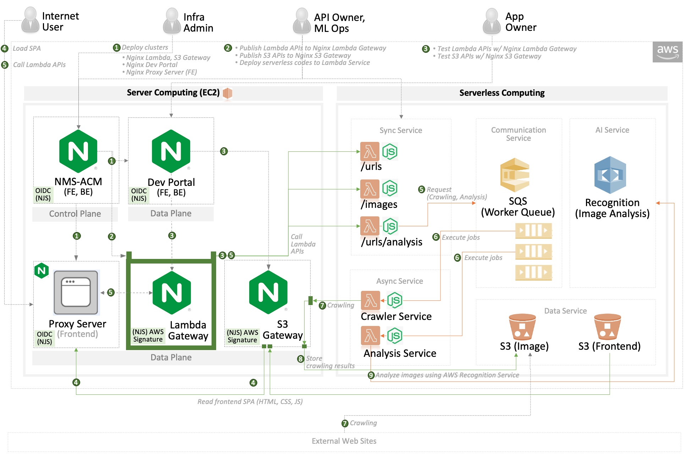
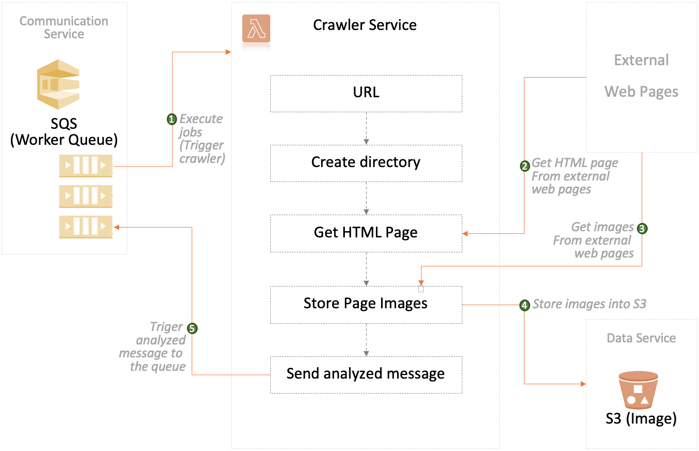
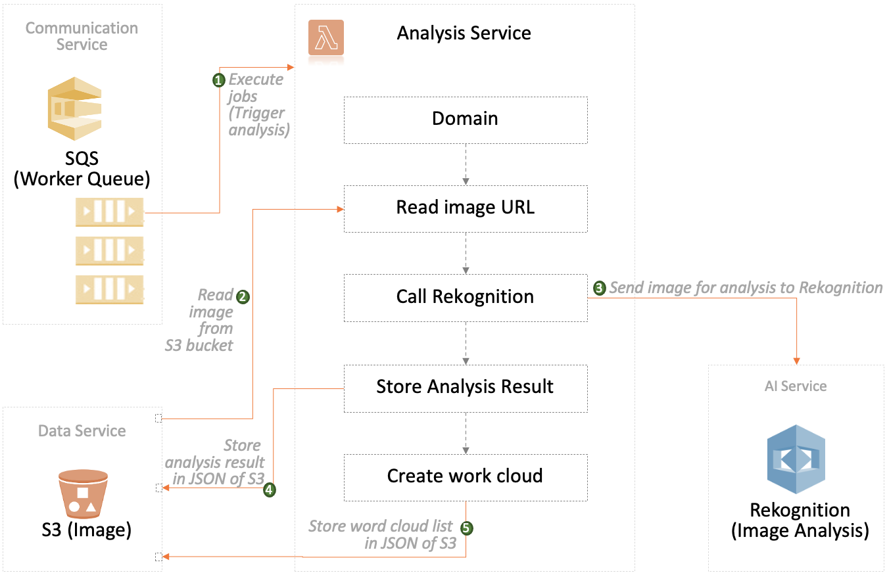

# nginx-serverless-image-recognition

NGINX Serverless AI: Image Recognition Service (Web Crawler &amp; Image Analysis)

## Serverless Crawler Service

## Serverless Analysis Service

Connect Amazon Rekognition Service with downloaded image files.

> Note: Amazon Rekognition makes it easy to add image and video analysis to your applications. 

